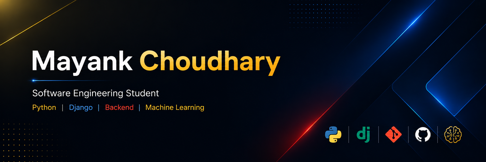

# Hi there, I'm Mayank Choudhary 👋

  

<h3 align="center">
Software Engineering Student • Python Developer • Backend Developer • Machine Learning Enthusiast
</h3>

  
  
  

  

---

## 🚀 About Me

🎓 Integrated M.Tech in Software Engineering at **VIT-AP University**

📈 **CGPA:** 8.58 / 10

💻 Python developer passionate about backend engineering, automation, and scalable web applications.

🌱 Currently learning **Machine Learning**, **Data Analytics**, and **Cloud Technologies**.

⚡ I enjoy solving real-world problems with clean, efficient, and maintainable code.

---

## 💼 Experience

### 💻 Freelance Full Stack Developer
**Aug 2023 – Present**

- Built business web applications using Django.
- Developed Python automation tools.
- Automated deployment and server management.
- Designed scalable backend solutions and REST APIs.

### 🏢 Software Development Intern — NSN Murthy Enterprises
**Jun 2025 – Jul 2025**

- Developed REST APIs using Django REST Framework.
- Automated workflows using Selenium and Pandas.
- Improved operational efficiency through automation.

---

# 💻 Tech Stack

### Languages

### Backend

- Django
- Django REST Framework (DRF)
- REST APIs

### Frontend

### Libraries & Tools

**Also Experienced With**

- Pandas
- NumPy
- Selenium
- Flask
- Git
- SQL
- Python Automation

---

## 📚 Currently Learning

- Machine Learning
- Data Analysis
- Artificial Intelligence
- System Design
- Cloud Deployment
- Advanced Django

---

## 🎯 Interests

- Backend Development
- REST API Development
- Automation
- Machine Learning
- Data Analytics
- Open Source
- Software Engineering

---

# 🔥 GitHub Streak

---

# 📈 Contribution Graph

---

# 🏆 GitHub Trophies

---

# 🎯 2026 Goals

- 🚀 Build production-ready Django applications
- 🤖 Develop AI & Machine Learning projects
- 📊 Master Data Analytics
- 🌍 Contribute to Open Source
- 💼 Secure a Software Engineering Internship

---

# 📫 Connect With Me

---

⭐ <b>Thanks for visiting my profile!</b> ⭐

